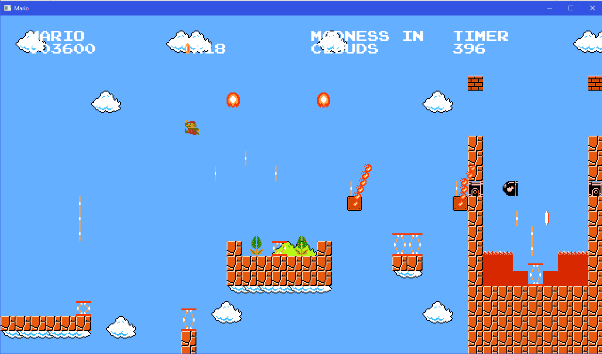
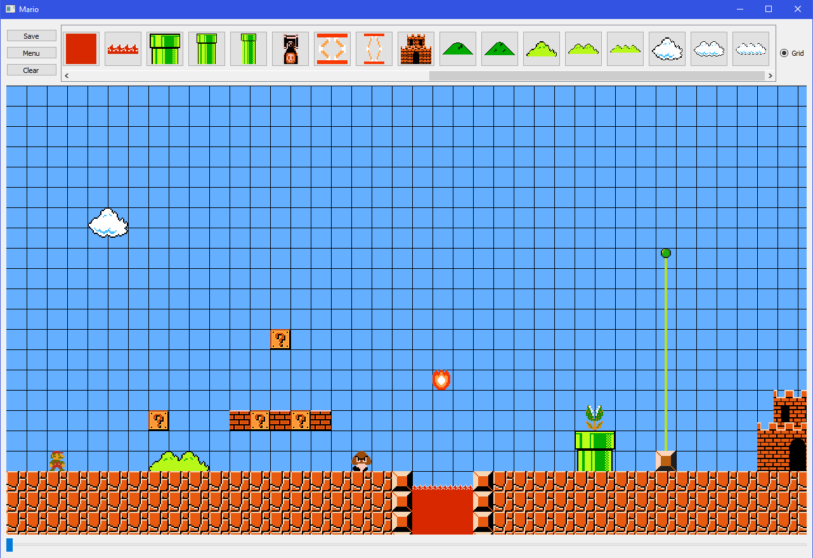
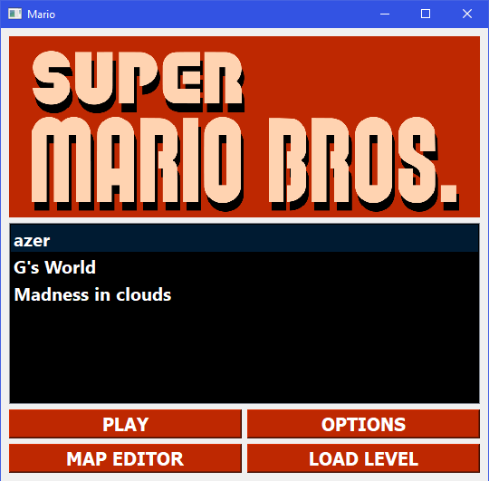
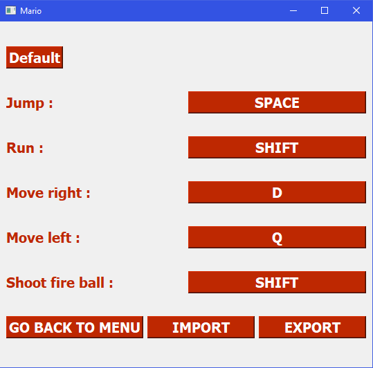

# Mario QT

[](https://opensource.org/licenses/MIT)

### Play it live at https://colintr.me/mario/Mario.html !

## Installation

For windows: <a id="raw-url" href="https://raw.githubusercontent.com/ColinTr/MarioQT/master/Mario_Editor_installer.exe">download the installer</a>

## Controls

- Q and D for left and right control
- Space to jump
- Shift to shoot fireball
- T to show hitboxes
- R to restart the level
- C for power-up





## To update and compile the code

1. Download [Qt Creator](https://www.qt.io/download-qt-installer-oss) and install Qt 5.15.2 MSCV 2019

2. Compiling an executable (see https://www.youtube.com/watch?v=rFHPOZoqzcg):
	```
	cd C:\Qt\5.15.2\msvc2019\bin\
	windeployqt.exe C:\Users\Username\Desktop\Mario.exe
	```

3. Compiling for webassembly (see https://www.youtube.com/watch?v=YSAUoAI5hQA):
	```
	cd emsdk
	emsdk activate 1.39.8
	cd mario-webassembly-build
	qmake MarioQT\source_code
	mingw32-make
	
	```
	If you have memory errors during mingw32-make, add the following flag to the Mario.pro file:
	> QMAKE_LFLAGS+= "-s TOTAL_MEMORY=33554432"

## Trailer

https://www.youtube.com/watch?v=-SCnSPH7mK8


## Qu'est-ce que c'est ?

Ce logiciel s'inscrit dans la réalisation du projet DI4 de C++ QT. Il a été réalisé par Guillaume Bouchard, Colin Troisemaine, Alexandre Turpin et Quentin Levieux.

Le but était de mettre en place un jeu platformer type Mario en utilisant QT et le MVC. Nous avons donc entrepris de reproduire le jeu Super Mario Bros NES.

## Installation

Le projet étant un projet QT, il est donc cross-platform. Nous recommandons l'installation de QTCreator pour la compilation du projet (Fichier -> "ouvrir un fichier ou projet" et sélectionner le Mario.Pro).

## Composition du logiciel

Le logiciel est composé de plusieurs parties, la partie principale étant le jeu en lui-même. Nous retrouvons également une éditeur de niveau graphique qui permet d'exporter les niveaux créés au format JSON, une fenetre de configuration des touches exportables également au format JSON, tout cela accessible depuis le menu principal.

## Fonctionnement du jeu

Le jeu respectant le modèle MVC se voit séparé en trois parties distinctes :

- Le modèle composé de sous classes d'ObjectModel qui représente tout les objets de notre jeux. Les objets sont alors répartis en deux catégories : les inerts (les objets ne bougeant pas) et les entitées (les objets avec la fonction advance()).

- La vue est composée de la classe GameView qui est un QWidget et qui va donc afficher les objets à l'écran à l'aide de Visitor (voir le design pattern).

- Le controlleur avec la classe GameController qui contient la boucle principal de notre jeux. GameController possède une liste d'objets et qui, à chaque itération de sa boucle principal (la fonction advance()), va calculer la nouvelle position des objets, vérifier qu'ils n'entrent pas en collision avec les autres objets, résoudre les collisions si besoin et enfin animer l'objet. On va ensuite appeler la vue pour lui indiquer qu'il faut qu'elle repeigne sa scene.

## Screenshots du jeu

- L'éditeur de niveaux :



- Le menu principal :



- Le menu d'options :




## License

This code is released under the MIT license. See the LICENSE file for more information.
